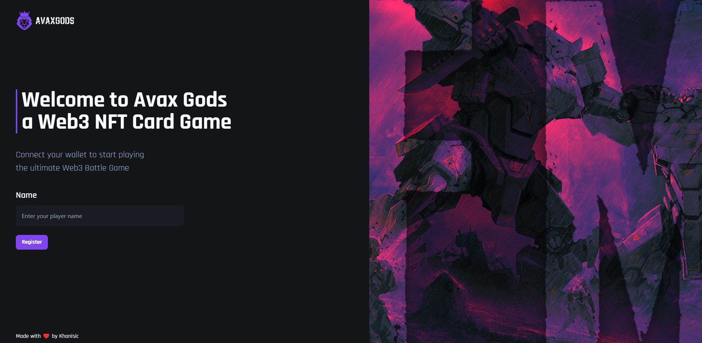
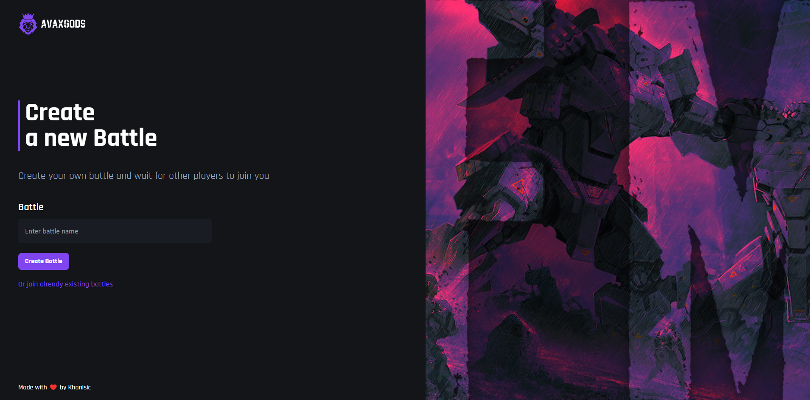
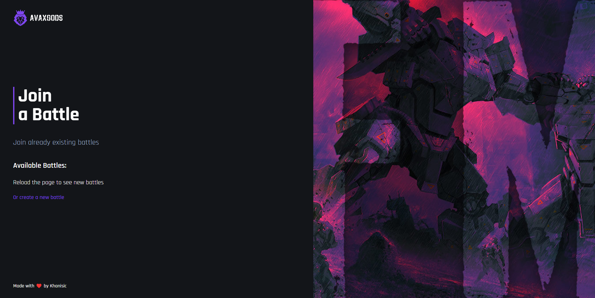
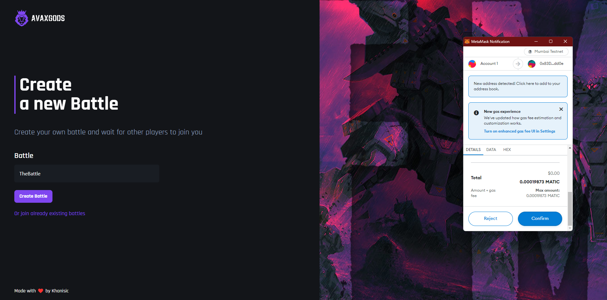
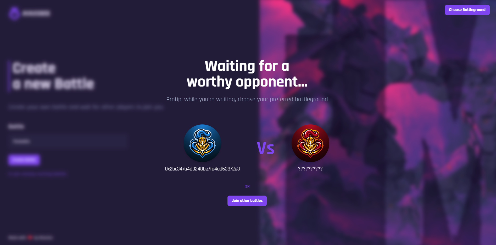
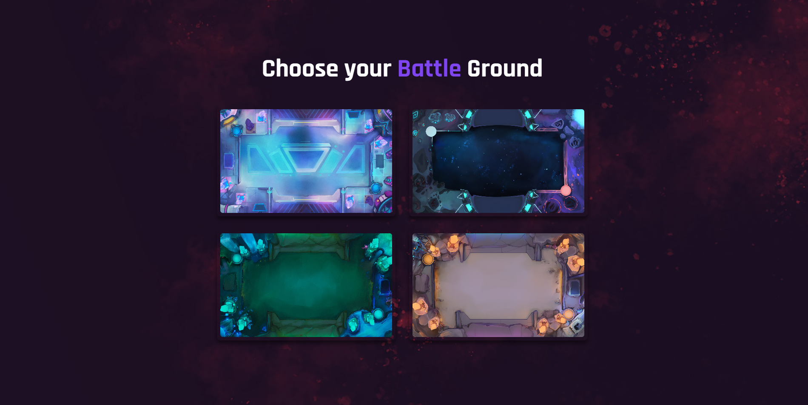
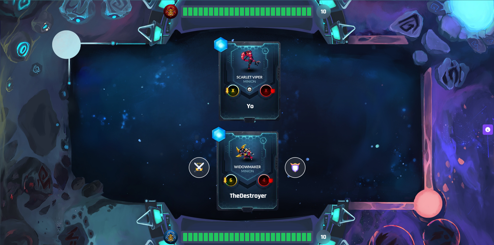
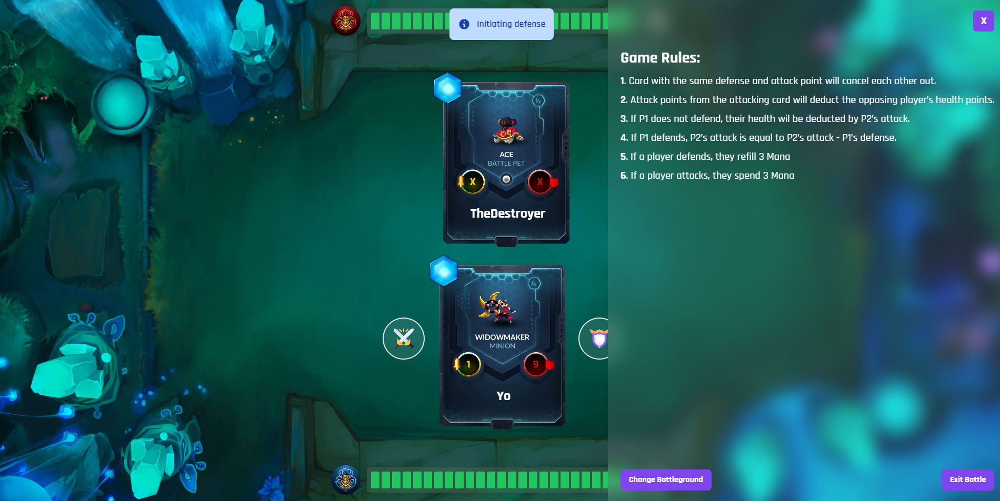

# Web3 Card game

<p>Hey guys, Khanisic/Abdul Moid Khan here 👋.</p>
<br/>
<p>Welcome to the AVAXGods Web3 Card game where you can battle your friends and test out who has that higher IQ among your friends. This game gets random at every round of action and each player is dealt with a hand it may or may not wish to see.</p>
<br/>
<p>I have used <i>Vite.js react framework,</i> to build the project deployed it on vercel. For the smart contract deployment, I've used hardhat and used MATIC to power the smart contract!</p>
<br/>

<p>Screenshots:</p>

<strong>Home page where users can register themselves.</strong>

<strong>Create battle page.</strong>

<strong>Join battle page.</strong>

<strong>Metamas pop-up for creating a new battle.</strong>

<strong>Battle page where the user is waiting for an opponent.</strong>

<strong>Players can choose their battlegrounds.</strong>

<strong>Battle page</strong>

<strong>Player defends and game rules.</strong>
Steps to install:

1.Run the npm install command.

```shell
npm install
```

2.After the dependencies have been installed, run the build command.

```shell
npm run dev
```


<p>Thank You ❤️</p>
